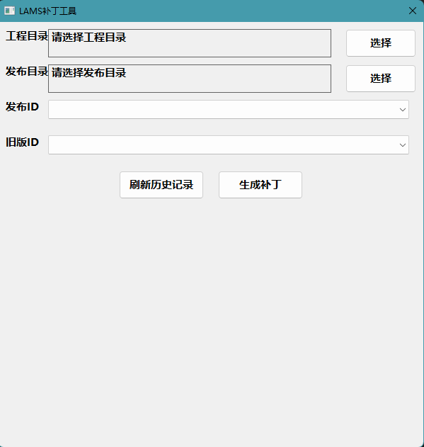

## 补丁包生成工具 用Rust + NWG实现。


构建启动不带控制台的程序

``` #![windows_subsystem = "windows"] ```

### 命令行启动参数传递
```  lams-patch.exe 项目地址 增量包保存地址 旧commitID 新commitId```

### 不带参数运行出gui界面


 是用nwg实现的简单界面，支持文件路径拖拽
 